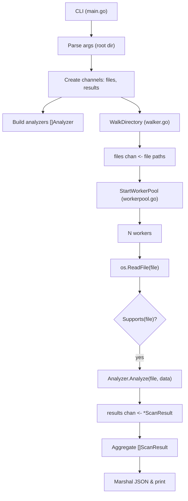

## Static Document Security Scanner

This project is a small, composable static document scanner implemented in Go.

For a step‑by‑step walkthrough of installation and usage, see **Guide.md**.

For a detailed list of currently supported document types and how to extend them, see **Supported_Document_Types.md**.

### What it does

- Walks a directory tree recursively
- Uses a worker pool to scan files concurrently based on `runtime.NumCPU()`
- Analyzes files using pluggable analyzers
- Computes SHA256 hashes for every scanned file
- Detects macro-enabled Word documents (`.docx`, `.docm`) by locating `vbaProject.bin` inside the ZIP structure
- Detects suspicious PDF indicators in `.pdf` files using simple heuristic string matching
- Emits structured JSON results on stdout

### Quick usage

From the `docscanner` directory (after cloning the repo):

```bash
go run ./cmd/scanner <directory>
```

Example (scan the provided samples directory from the repo root):

```bash
go run ./cmd/scanner ../samples
```

The CLI prints an array of JSON objects, each matching the `ScanResult` model defined in `internal/model/result.go`.

To save the JSON output to a file instead of just printing it:

```bash
go run ./cmd/scanner ../samples > results.json
```

You can then open `results.json` in your editor.

For more detailed usage patterns (different directories, troubleshooting, etc.) see **Guide.md**.

### Supported document types

Out of the box, the scanner understands:

- Microsoft Word: `.docx`, `.docm`
- PDF: `.pdf`

Other file types are walked but ignored unless you implement and register a new analyzer. See **Supported_Document_Types.md** for details.

### Extensibility

- New document types can be added by implementing the `Analyzer` interface in `internal/analyzer/analyzer.go`.
- The worker pool and directory walker do not need to change when new analyzers are introduced.

This is intentionally a foundation: a minimal but solid base to grow more advanced detection logic.

### Backend / hosting notes

The code is structured so the core scanning logic under `internal/` can be reused from a long‑running backend service (for example, an HTTP API). A typical next step is to add a `cmd/server` entrypoint that:

- Listens on an HTTP port
- Accepts scan requests (e.g. directory paths or uploaded files)
- Invokes the existing walker, worker pool, and analyzers to produce `ScanResult` JSON

Once such a server entrypoint exists, you can deploy it to platforms like Render as a Go web service.

### Code structure overview

High-level flow:

```text
main.go
	├─ parses CLI args
	├─ creates channels (files, results)
	├─ builds analyzers []Analyzer
	├─ starts directory walker (WalkDirectory)
	├─ starts worker pool (StartWorkerPool)
	└─ aggregates []ScanResult and prints JSON

WalkDirectory (internal/scanner/walker.go)
	└─ walks the filesystem and pushes file paths into files chan

StartWorkerPool (internal/scanner/workerpool.go)
	└─ spins up N workers
			 └─ for each file:
						├─ os.ReadFile
						├─ pick matching Analyzer via Supports
						└─ Analyzer.Analyze → *ScanResult → results chan

Analyzers (internal/analyzer/*.go)
	├─ WordAnalyzer  – detects vbaProject.bin in .docx/.docm
	└─ PDFAnalyzer   – scans for suspicious PDF keywords

Model (internal/model/result.go)
	└─ ScanResult – structure that is serialized to JSON
```

### Data flow (Mermaid)

