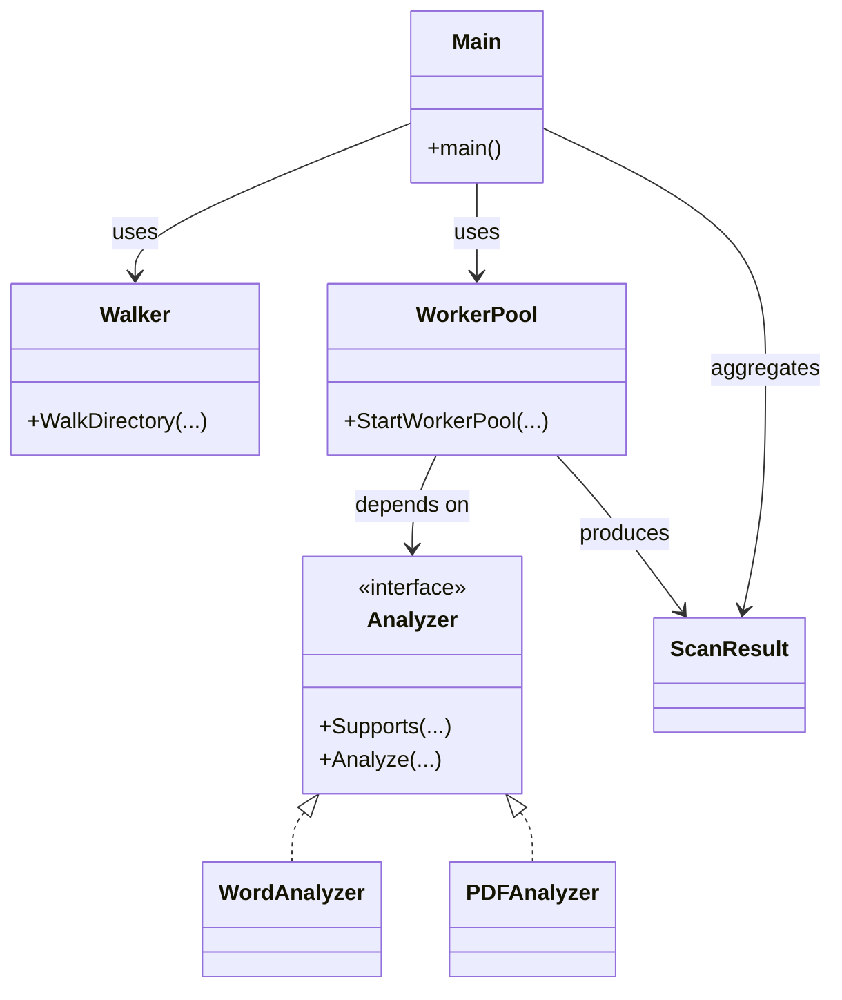

- Directory walking → only finds files
- Worker pool → handles concurrency
- Analyzer → inspects file contents
- Result aggregator → collects scan results
- Main → orchestration only
---

- No analyzer should know about directory walking.
- No walker should know about PDF heuristics.
- No worker should know about JSON formatting or CLI specifics.

<i> That separation is what keeps systems from turning into spaghetti. </i>

### Code architecture (Mermaid)

